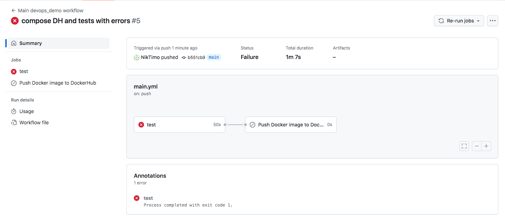
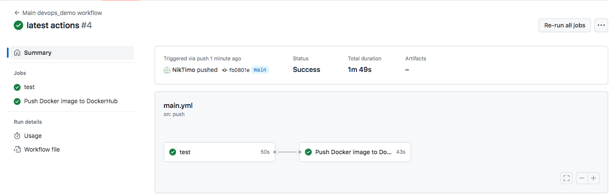

# Описание

Тестовое задание на должность стажера DevOps. Выполнил Николай Т.

Выполнены следующие задания:
1. Подготовлен Compose для сборки и запуска сервиса с базой данных.

2. Реализован CI процесс в GitHub Actions по проведению тестов и сборке образа docker. Триггером служит коммит в ветку main. Задача по сборке образа зависит от результата прохождения тестов и, в случае наличия ошибок, не запускается. Результат запуска при наличии ошибок в тестах представлен на скриншоте.



3. Первое задание выполненно с усложнением в виде работы через шлюз nginx, реализовано создание SuperUser при запуске Compose.

4. Второе задание выполнено с усложнением в виде тегирования тегом latest и загрузкой образа в DockerHub. Результат успешного прохождения тестов и выгрузки собранного образа на DockerHub представлен на скриншоте. Образ доступен по [ссылке](https://hub.docker.com/r/niktimo/devops_demo_hq).



## Запуск сервиса
1. Клонировать репозиторий и войти в корневую папку проекта:
```
git clone git@github.com:NikTimo/devops-demo-service.git
cd devops-demo-service
```
2. Для запуска сервиса необходимо создать в корневой папке проекта файл .env с переменными окружения. Ниже представлен пример содержимого файла.
```
# Database Variables
POSTGRES_USER=postgres
POSTGRES_PASSWORD=postgres
POSTGRES_DB=postgres
DB_HOST=db
DB_PORT=5432

# Django SuperUser Variables
DJANGO_SUPERUSER_USERNAME=admin
DJANGO_SUPERUSER_EMAIL=admin@admin.ru
DJANGO_SUPERUSER_PASSWORD=123

# Django Variables
DB_NAME=postgres
DB_USER=postgres
DB_PASSWORD=postgres
```
2. Запуск compose `docker compose up --build`

3. После запуска панель администратора достпуна по адресу [http://localhost:9999/admin/](http://localhost:9999/admin/)

4. Для проверки работоспособности CI процесса необходимо выполнить форк текущего репозитория, добавть в GitHub Secrets секреты `DOCKER_USERNAME` и `DOCKER_PASSWORD` с учетными данными DockerHub и выполнить любой коммит в в ветку main.

5. Для проверки работосособности собранного мной образа создан файл docker-compose-dockerhub.yml, запускающий compose из образа с моего DcokerHub. Для запуска используется команда:
</br>`docker compose -f docker-compose-dockerhub.yml up`


## Особенности, заменчания и изменения в исходных файлах
1. Для контроля базы данных в контейнере применен скрипт [Wait-for-it.sh](https://github.com/vishnubob/wait-for-it). Стандартные средства depends_on не обепечивают контроля запуска содержимого контенейра, а не самого контейнера, таким образом возможна ситуация, когда контейнера уже запущен, а база данных в нем - нет. Скрипт контролирует возможность соединения с базой данных по заданным хосту и порту. Актуально при первом запуске, инициализации базы.

2. Согласно усложнению добавлена команда в стартовый скрипт для создания SuperUser с параметрами из переменных окружения: `python manage.py createsuperuser --noinput --username $DJANGO_SUPERUSER_USERNAME --email $DJANGO_SUPERUSER_EMAIL`.
</br>С моей точки зрения, не самая лучшая практика: это действие требуется один раз при инициализации проекта и базы данных, в последующих развертываниях будет вызывать ошибку `CommandError: Error: That username is already taken.`. Правильнее будет единожды, в ручном режиме, передать в контейнер с Django команду на создание SuperUser.

3. Старался миинимально затрагивать исходные файлы проекта, поэтому, к примеру, скрипты передаются через volume в compose.

4. В головной файл urls.py добавлен путь для статики админ-панели Django.

5. В Dockerfile преобразовал установку зависимостей в одну команду, т.к. при повторном вызове pip install не добавляет исполнительный файл gunicorn в $PKGS_DIR/bin. Использование опции --upgrade приводит к перезаписи папки $PKGS_DIR/bin и удалению исполняемых файлов от установки зависимостей.

Было:
```
# Install dependencies to local folder
RUN pip install --target=$PKGS_DIR -r ./requirements.txt
RUN pip install --target=$PKGS_DIR gunicorn
```
Стало:
```
# Install dependencies to local folder
RUN pip install --target=$PKGS_DIR -r ./requirements.txt gunicorn
```